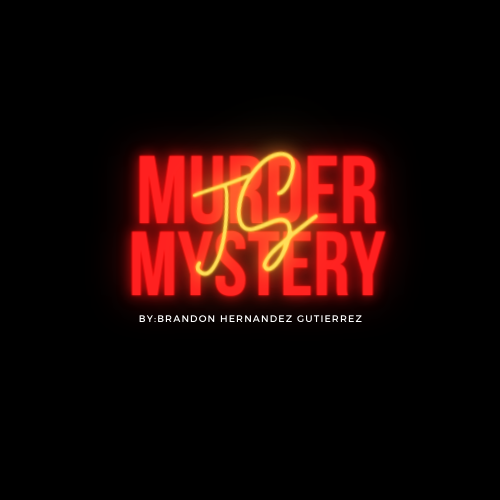
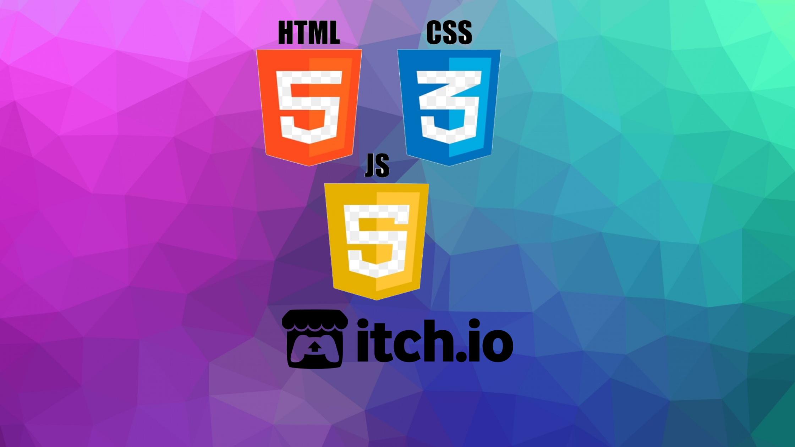
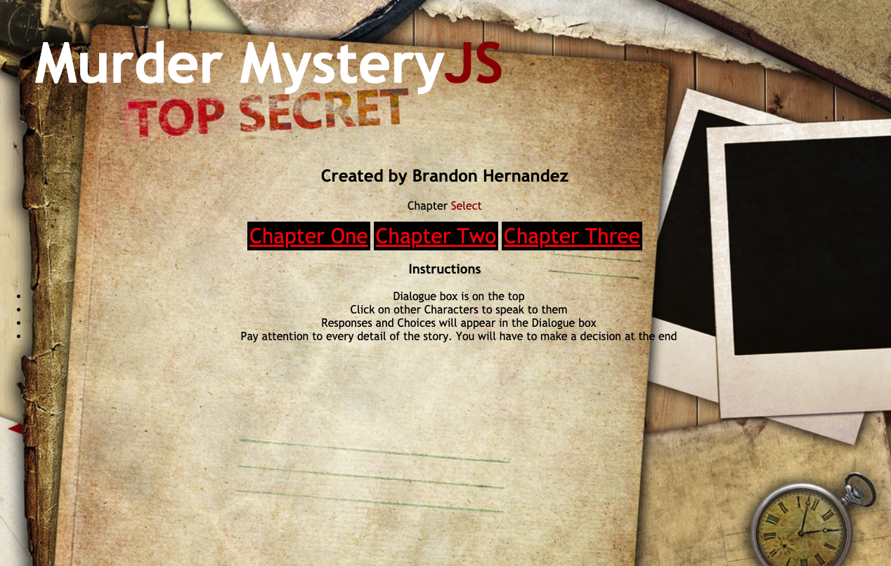
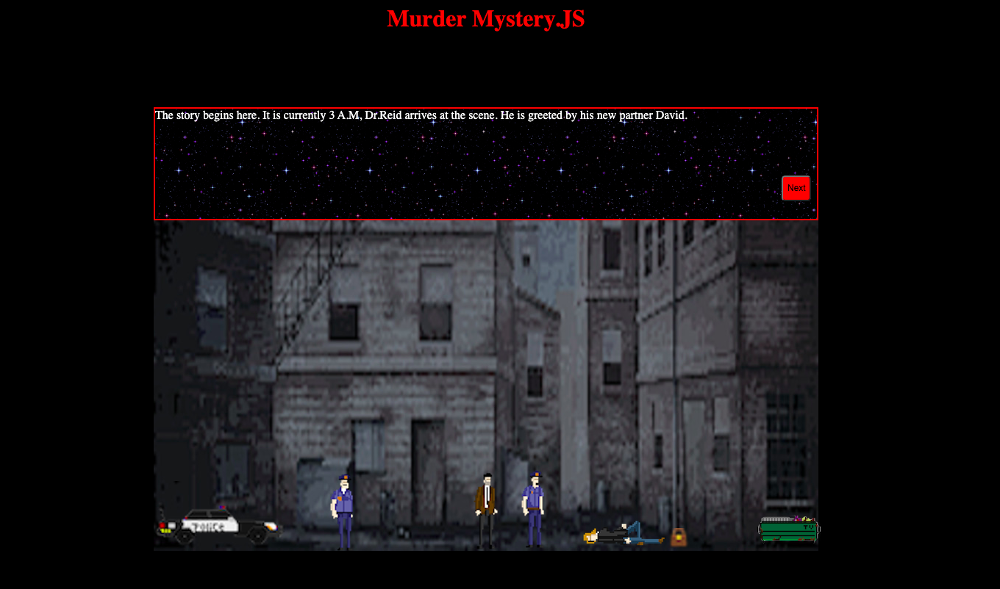
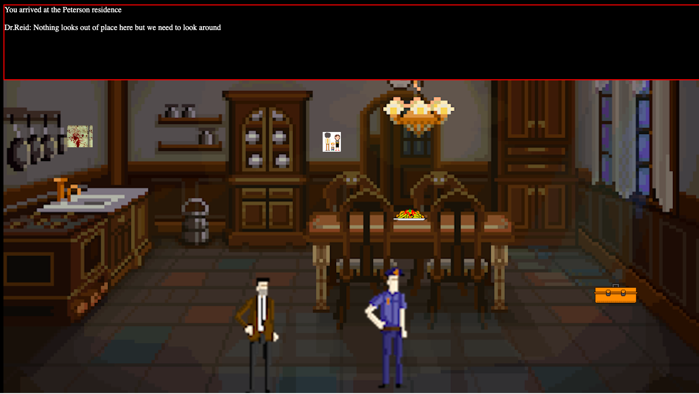

# Murder Mystery JS

## Date: 08/13/2021

### by Brandon Hernandez

 [GitHub](https://github.com/brandonhernandez123) | [Indeed](https://my.indeed.com/resume?hl=en&co=US&from=gnav-menu-resume--myind) | [LinkedIn](www.linkedin.com/in/brandonhdzgtz)
***
***Description***

Play Game on Surge [Murder Mystery Js](brandonhdzmurdermysteryjs.surge.sh)

Murder Mystery JS is a point and click thriller/mystery game. You play as the main character named detective Reid and are attempting to solve the murder of an innocent old lady. You have a brand new homocide detective named David as your partner for this case. As you progress throughout the story the Details get more gruesome and intense.

***Technologies Used***
* HTML5
* CSS
* Javascript
* Itch io
  
  

***Getting started***

Dialogue box is on the top
Click on other Characters to speak to them
Responses and Choices will appear in the Dialogue box
Pay attention to every detail of the story. You will have to make a decision at the end

***Screenshots***
##### Intro Screen

##### Chapter One

##### Chapter Two

***
***Future updates***
- [ ] Add walking Animations
- [ ] Add bonus chapters
- [ ] Change gamescreen styling
- [ ] Add Journal to keep clues and passwords
- [ ] Add action sequences

***Credits***

Background images: [Google](https://www.google.com/)

Character Assets: [itch.io](itch.io)

For animation assistance: [W3Schools](w2schools.com)
